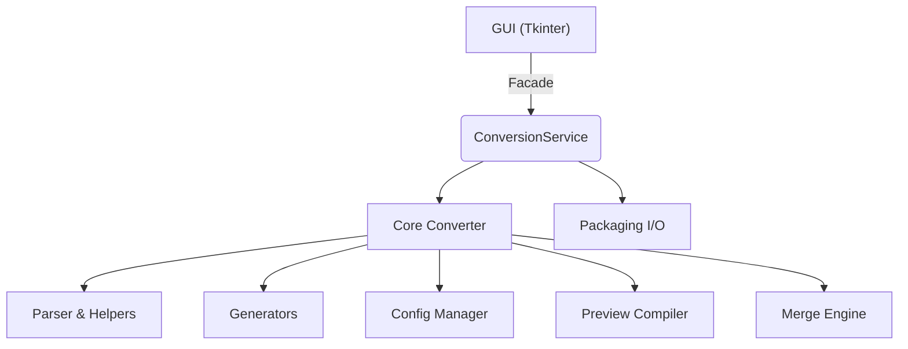

# Orlando Toolkit – Architecture Overview

## 📚 Documentation Navigation

- **[Runtime Flow](./runtime_flow.md)** - Detailed workflow and sequence diagrams
- **[Core Modules](../orlando_toolkit/core/README.md)** - Core processing layer documentation
- **[UI Components](../orlando_toolkit/ui/README.md)** - User interface documentation
- **[Configuration](../orlando_toolkit/config/README.md)** - Configuration management

---

## 1 Introduction

Orlando Toolkit converts structured Microsoft Word manuals to standalone DITA projects and bundles them as ready-to-publish ZIP archives. The codebase follows a classic layered architecture:



Each layer is import-only towards those below it, giving us clear dependency boundaries and facilitating unit-testing.

---

## 2 Package structure

```
orlando_toolkit/
    app.py                 # GUI entry-point widget (Tk)
    logging_config.py      # Centralised logging setup
    core/                  # Core processing layer → [📖 Documentation](../orlando_toolkit/core/README.md)
        models.py          # Immutable data structures (DitaContext…)
        parser/            # WordprocessingML traversal utilities
        converter/         # DOCX→DITA conversion logic (pure functions, no I/O)
        generators/        # XML builders (tables etc.) kept separate from the main algorithm for clarity
        services/          # Business-logic façade (ConversionService)
        merge.py           # Advanced topic merging with depth and style exclusions
        preview/           # XML compilation and HTML rendering for real-time preview
        utils.py           # Helper utilities (slugify, XML save, colour mapping)
    config/                # Configuration management → [📖 Documentation](../orlando_toolkit/config/README.md)
        manager.py         # YAML loader + runtime overrides
    ui/                    # Modernised Tkinter tabs/widgets → [📖 Documentation](../orlando_toolkit/ui/README.md)
        metadata_tab.py    # Document metadata configuration
        image_tab.py       # Image management and naming
        structure_tab.py   # Topic hierarchy and structural editing
        custom_widgets.py  # Reusable UI components
        dialogs.py         # Modal dialog utilities
    resources/            # (reserved)
```

Runtime artefacts
* Logs are written to `./logs/` (overridable with `$ORLANDO_LOG_DIR`).
* Temporary build folders are created under the OS temp directory and removed automatically.

---

## 3 Runtime workflow

1. `run.py` initialises logging and instantiates `app.OrlandoToolkit`.
2. The user selects a `.docx`; the GUI calls
   ```python
   ConversionService().convert(docx_path, metadata)
   ```
3. The service delegates to `core.converter.convert_docx_to_dita()` which:
   * extracts images and headings via `core.parser.*`,
   * emits DITA topics/maps through the generators, and
   * fills a `DitaContext` with in-memory XML trees and blobs.
4. The converted document is presented in a three-tab interface:
   * **Metadata**: Configure document properties and revision information
   * **Images**: Preview and rename extracted graphics
   * **Structure**: Configure topic depth, preview hierarchy, and perform structural editing
5. On "Generate package" the service
   * applies topic merging based on depth limits and style exclusions,
   * renames files (stable IDs),
   * and writes a zipped archive.

Errors propagate as exceptions. The GUI shows message boxes; future CLI wrappers will map them to exit codes.

---

## 4 Core components

| Module | Purpose | Documentation |
|--------|---------|---------------|
| `models.DitaContext` | Immutable container for topics, images, ditamap & metadata. | [Core README](../orlando_toolkit/core/README.md) |
| `parser.docx_utils`  | Streaming traversal of Word blocks + image extraction. | [Core README](../orlando_toolkit/core/README.md) |
| `parser.style_analyzer` | Infers heading levels from DOCX style/numbering definitions. | [Core README](../orlando_toolkit/core/README.md) |
| `converter.docx_to_dita` | Main algorithm; stateless, pure-function style. | [Core README](../orlando_toolkit/core/README.md) |
| `converter.helpers`  | Small utilities migrated from legacy script to keep `docx_to_dita` lean. | [Core README](../orlando_toolkit/core/README.md) |
| `converter.structure_builder` | Two-pass conversion implementation for role determination. | [Core README](../orlando_toolkit/core/README.md) |
| `generators.dita_builder` | XML builders for tables (Phase 3 extraction). | [Core README](../orlando_toolkit/core/README.md) |
| `services.conversion_service` | Orchestrates end-to-end workflow and filesystem I/O. | [Core README](../orlando_toolkit/core/README.md) |
| `merge.merge_topics_unified` | Advanced topic merging with depth limits and style exclusions. | [Core README](../orlando_toolkit/core/README.md) |
| `preview.xml_compiler` | Real-time XML compilation and HTML rendering for structure preview. | [Core README](../orlando_toolkit/core/README.md) |

---

## 5 Structure Tab and Preview System

The **StructureTab** provides comprehensive control over document hierarchy and real-time preview capabilities. For detailed UI usage information, see the [UI Documentation](../orlando_toolkit/ui/README.md).

### 5.1 Topic Depth Control
- Configurable maximum heading level for topic splitting (1-9)
- Real-time preview shows exactly how the final ZIP structure will appear
- Unified merge engine applies both depth limits and style exclusions in a single pass

### 5.2 Structural Editing
- Tree view with drag-like operations: move up/down, promote/demote topics
- Search functionality with navigation controls
- Heading filter to exclude specific Word styles at different levels
- Undo/redo support for all structural modifications

### 5.3 Preview Capabilities
- XML preview with browser rendering for individual topics
- HTML compilation using embedded XSLT transforms
- Image embedding as data URIs for complete offline preview
- Raw XML inspection for debugging and validation

### 5.4 Advanced Merge Operations
The merge engine (`core.merge`) supports:
- **Depth-based merging**: Topics beyond specified depth are merged into parents
- **Style-based exclusions**: Specific Word styles can be excluded at any level
- **Unified processing**: Single-pass algorithm prevents content loss
- **Smart content modules**: Automatic creation of content-bearing topics for structural sections

---

## 6 Topic Merge Engine

The merge system (`core.merge`) provides sophisticated topic consolidation capabilities to control document granularity and structure:

### 6.1 Merge Strategies

**Unified Merge Algorithm (`merge_topics_unified`)**
- Single-pass processing that combines depth and style criteria
- Prevents content loss by applying all merge rules simultaneously
- Supports both depth limits and per-level style exclusions

**Title-based Merge (`merge_topics_by_titles`)**
- Merges topics with specified titles regardless of depth
- Case-insensitive and whitespace-tolerant matching
- Preserves title as formatted heading in merged content

### 6.2 Merge Criteria

**Depth-based Merging**
- Topics deeper than the specified limit are merged into their parent
- Configurable depth limit (1-9 levels)
- Maintains document hierarchy while reducing topic count

**Style-based Exclusions**
- Exclude specific Word styles at different heading levels
- Configurable per-level exclusion maps: `{level: {style_names}}`
- Allows fine-grained control over topic boundaries

### 6.3 Content Preservation

**Heading Formatting**
- Merged topic titles become bold, underlined paragraphs
- Preserves visual hierarchy in consolidated content
- Maintains readability in merged topics

**Content Merging**
- Block-level elements (paragraphs, lists, tables) are preserved
- Source topic structure is maintained during merge
- Images and references are correctly transferred

### 6.4 Structural Optimization

**Content Module Creation**
- Automatically creates content-bearing topics for structural sections
- Prevents orphaned content in pure structural headings
- Optimizes section/module relationships

**Redundancy Collapse**
- Removes redundant section/module pairs
- Promotes solo children to eliminate unnecessary nesting
- Cleans up orphaned topics after merge operations

---

## 7 Configuration

`ConfigManager` looks for YAML files packaged within the wheel **and** user overrides under `~/.orlando_toolkit/`. Sections:
* `style_map`         – overrides for Word style → heading level.
* `color_rules`       – text-colour → outputclass mapping.
* `image_naming`      – future: custom image naming templates.
* `logging`           – optional `logging.yml` applied via `logging.config.dictConfig()`.

If PyYAML is missing, built-in defaults guarantee the application still runs.

---

## 8 Resources

As of the current version, the generated ZIP is **self-contained without embedded DTDs or ditaval files**. All public identifiers remain intact so any downstream toolchain (incl. Orlando CMS) can resolve them through its own catalog. DOCTYPE declarations use simple filenames (e.g., "concept.dtd") to ensure compatibility with external catalog systems.

---

## 9 Build & distribution

* **Windows executable** – `build_exe.py` calls PyInstaller with
  single-file, windowed mode, bundling assets.
* **Source distribution** – `python -m build` produces a PEP 517 wheel; no C-extensions.

---

## 10 Extension points / future work

* Headless CLI wrapper (non-Tk).
* Plugin system for custom image naming schemes.
* Enhanced preview rendering with full DITA-OT integration.
* Export capabilities for structure modifications.

---

