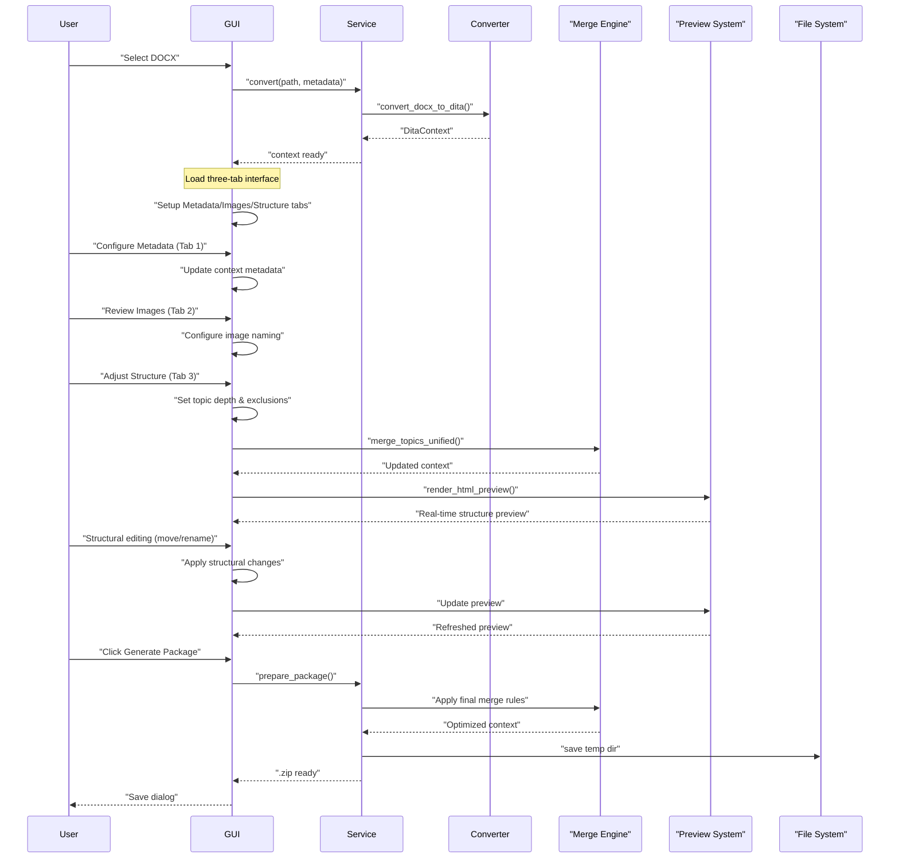

# Runtime Flow

📖 **[← Back to Architecture Overview](./architecture_overview.md)**

## Workflow Details

### 1. Document Loading
- User selects DOCX file through file dialog
- Conversion service performs initial DOCX → DITA transformation
- GUI transitions from home screen to three-tab interface

### 2. Three-Tab Configuration
**Metadata Tab**
- Configure document title, manual code, revision date
- Set Orlando-specific metadata properties
- Changes propagate to other tabs via callbacks

**Images Tab**
- Preview all extracted images with thumbnails
- Configure naming prefixes and conventions
- Real-time filename preview with section-based numbering

**Structure Tab**
- Set maximum topic depth (1-9 levels)
- Configure style exclusions at different heading levels
- Real-time merge preview shows final document structure
- Structural editing with move/promote/demote operations
- Search and filter capabilities
- XML preview for individual topics

### 3. Real-Time Processing
- All structural changes are applied immediately to a working copy
- Preview system renders HTML using embedded XSLT transforms
- Merge engine applies depth and style rules in unified single-pass
- Undo/redo support for all structural modifications

### 4. Package Generation
- Final merge rules applied based on current configuration
- Topics and images renamed with stable identifiers
- Self-contained ZIP archive generated without embedded DTDs
- DOCTYPE declarations use simple filenames for catalog compatibility

### 5. Error Handling
- Conversion errors shown via message boxes
- Background operations use progress indicators
- Logging system provides detailed debugging information

